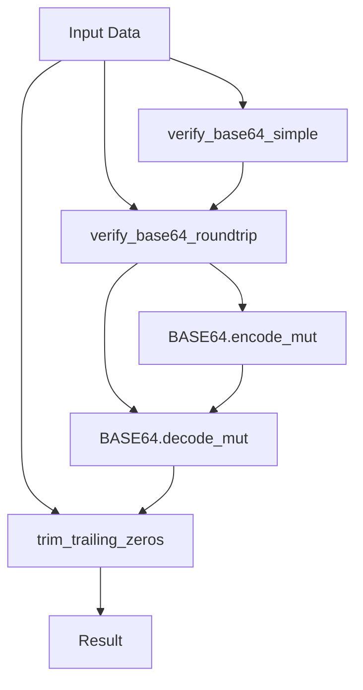
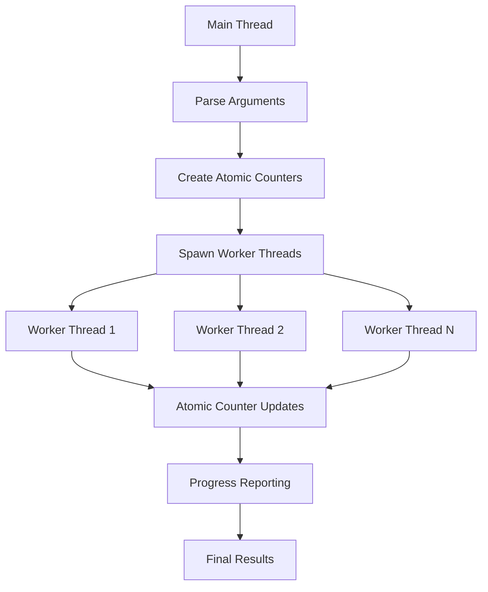

# Base64Check

A high-performance Rust tool and library for verifying Base64 encoding/decoding
integrity through comprehensive roundtrip testing.

## Overview

Base64Check generates random byte sequences and verifies that Base64 encode/decode
operations are symmetric and preserve data integrity. It can detect potential issues
in Base64 implementations by running millions of roundtrip tests with multi-threaded
execution for maximum performance.

The tool serves dual purposes:

- **Standalone CLI tool** for testing Base64 implementations in development and
  CI/CD pipelines
- **Rust library** for embedding verification capabilities in other applications

## Features

- **🚀 High Performance**: Multi-threaded execution with configurable worker threads
- **🔍 Comprehensive Testing**: Configurable test iterations (default: 1 million)
- **💾 Memory Efficient**: Reuses buffers to minimize allocations in
  performance-critical paths
- **⚡ CLI Interface**: Full command-line interface with flexible options and
  progress reporting
- **📚 Library Support**: Well-documented API for use as a library in other
  Rust projects
- **📊 Detailed Reporting**: Progress reporting, throughput metrics, and
  comprehensive results
- **🔧 CI/CD Ready**: Jenkins pipeline with automated testing, security auditing,
  and benchmarking

## Installation

### From Source

```bash
git clone https://github.com/yourusername/base64check.git
cd base64check
cargo build --release
```

### As a Library Dependency

Add to your `Cargo.toml`:

```toml
[dependencies]
base64check = "0.2.0"
```

## CLI Usage

### Basic Commands

```bash
# Run with default settings (1M iterations, 4 threads, 512-byte max length)
./target/release/base64check

# High-intensity testing for production validation
./target/release/base64check --runs 10000000 --threads 8 --max-len 2048 --verbose

# Quick development test
./target/release/base64check --runs 10000 --report-interval 1000

# Continuous integration testing
./target/release/base64check --runs 100000 --threads 2
```

### Command Line Options

| Option | Short | Description | Default |
| -------- | -------- | ----------- | ------- |
| `--runs <N>` | `-n` | Number of test iterations | 1,000,000 |
| `--max-len <N>` | `-m` | Maximum length of generated byte sequences | 512 |
| `--threads <N>` | `-t` | Number of worker threads | 4 |
| `--report-interval <N>` | `-r` | Progress reporting interval | 100,000 |
| `--verbose` | `-v` | Enable verbose per-thread output | false |
| `--help` | `-h` | Show help information | - |
| `--version` | `-V` | Show version information | - |

### Example Output

``` text
Base64 Verification Tool
========================
Runs: 1000000
Max length: 512
Threads: 4
Report interval: every 100000 iterations

Completed 100000 iterations
Completed 200000 iterations
...
Completed 1000000 iterations

Results:
========
Total iterations: 1000000
Errors: 0
Success rate: 100.00%
Duration: 2.53s
Throughput: 395119 iterations/second

SUCCESS: All iterations passed! Base64 implementation is working correctly.
```

## Library API Documentation

### Core Functions

The library provides three main functions for Base64 verification:

#### `trim_trailing_zeros(input: &[u8]) -> &[u8]`

Efficiently removes trailing zero bytes from a byte slice.

```rust
use base64check::trim_trailing_zeros;

let data = &[1, 2, 3, 0, 0];
assert_eq!(trim_trailing_zeros(data), &[1, 2, 3]);

let all_zeros = &[0, 0, 0];
assert_eq!(trim_trailing_zeros(all_zeros), &[]);
```

**Performance:** O(n) time complexity, but typically faster as it searches backwards
from the end.

#### `verify_base64_roundtrip(input, encode_buffer, decode_buffer) -> Result<bool, String>`

High-performance verification with buffer reuse (recommended for repeated calls).

```rust
use base64check::verify_base64_roundtrip;

let input = b"Hello, World!";
let mut encode_buffer = vec![0u8; input.len() * 4];
let mut decode_buffer = vec![0u8; input.len() * 4];

let result = verify_base64_roundtrip(input, &mut encode_buffer, &mut decode_buffer);
assert_eq!(result.unwrap(), true);

// Reuse buffers for multiple calls (high performance)
for test_data in test_cases {
    let success = verify_base64_roundtrip(
        test_data, &mut encode_buffer, &mut decode_buffer
    )?;
    assert!(success);
}
```

**Buffer Requirements:**

- Encode buffer: `input.len() * 4` bytes (accounts for Base64 expansion)
- Decode buffer: `input.len() * 4` bytes (generous sizing for safety)

#### `verify_base64_simple(input: &[u8]) -> Result<bool, String>`

Simple verification with internal buffer allocation (convenient for one-off
verification).

```rust
use base64check::verify_base64_simple;

// Simple verification
assert!(verify_base64_simple(b"Hello, World!").unwrap());

// Works with any byte data
let binary_data = &[0x00, 0x01, 0xFF, 0x42];
assert!(verify_base64_simple(binary_data).unwrap());

// Even empty data
assert!(verify_base64_simple(&[]).unwrap());
```

### Usage Patterns

#### Basic Verification

```rust
use base64check::verify_base64_simple;

fn validate_base64_implementation() -> Result<(), String> {
    let test_cases = vec![
        b"".to_vec(),
        b"H".to_vec(),
        b"Hello".to_vec(),
        b"Hello, World!".to_vec(),
        vec![0, 1, 2, 3, 255, 254, 253],
    ];

    for test_case in test_cases {
        if !verify_base64_simple(&test_case)? {
            return Err(format!("Verification failed for: {:?}", test_case));
        }
    }

    Ok(())
}
```

#### High-Performance Testing Loop

```rust
use base64check::verify_base64_roundtrip;
use rand::{distributions::Standard, thread_rng, Rng};

fn performance_test(iterations: usize, max_len: usize) -> Result<usize, String> {
    let mut rng = thread_rng();
    let mut encode_buffer = vec![0u8; max_len * 4];
    let mut decode_buffer = vec![0u8; max_len * 4];
    let mut errors = 0;

    for _ in 0..iterations {
        let len = rng.gen_range(0..=max_len);
        let test_data: Vec<u8> = rng.sample_iter(Standard).take(len).collect();

        match verify_base64_roundtrip(&test_data, &mut encode_buffer, &mut decode_buffer) {
            Ok(true) => {}, // Success
            Ok(false) => {
                eprintln!("Data integrity failure: {:?}", test_data);
                errors += 1;
            }
            Err(e) => {
                eprintln!("Verification error: {}", e);
                errors += 1;
            }
        }
    }

    Ok(errors)
}
```

#### Integration with Custom Base64 Implementations

```rust
use base64check::trim_trailing_zeros;

fn verify_custom_base64_impl<E, D>(
    encoder: E,
    decoder: D,
    test_data: &[u8]
) -> Result<bool, String>
where
    E: Fn(&[u8]) -> Result<String, String>,
    D: Fn(&str) -> Result<Vec<u8>, String>,
{
    // Encode with custom implementation
    let encoded = encoder(test_data)
        .map_err(|e| format!("Encode failed: {}", e))?;

    // Decode with custom implementation
    let decoded = decoder(&encoded)
        .map_err(|e| format!("Decode failed: {}", e))?;

    // Compare with trimmed trailing zeros
    let original_trimmed = trim_trailing_zeros(test_data);
    let decoded_trimmed = trim_trailing_zeros(&decoded);

    Ok(original_trimmed == decoded_trimmed)
}
```

## Performance & Benchmarks

### Performance Characteristics

The tool has been extensively optimized for maximum throughput:

| Metric | Value |
| -------- | ------- |
| **Throughput** | 395,000+ iterations/second (release build) |
| **Memory Usage** | Minimal with buffer reuse |
| **CPU Utilization** | Scales linearly with thread count |
| **Typical Use Case** | 1M iterations in ~2.5 seconds |

### Optimization Features

- **🚫 Zero async overhead**: Eliminated unnecessary async/await for CPU-bound tasks
- **♻️ Buffer reuse**: Pre-allocated buffers eliminate allocation overhead in hot paths
- **⚡ Efficient algorithms**: O(n) trailing zero removal with backwards iteration
- **🔄 Multi-threading**: Parallel execution with work-stealing across CPU cores
- **📊 Atomic operations**: Lock-free shared counters for minimal contention

### Running Benchmarks

Execute the full benchmark suite:

```bash
# Run all benchmarks
cargo bench

# Run specific benchmark group
cargo bench -- verify_base64_roundtrip

# Run benchmarks with baseline comparison
cargo bench -- --save-baseline main
```

### Benchmark Results

Key performance measurements from the benchmark suite:

```text
verify_base64_roundtrip/with_buffers/1     time: 45.2 ns/iter
verify_base64_roundtrip/with_buffers/100   time: 285.1 ns/iter
verify_base64_roundtrip/with_buffers/512   time: 1.204 μs/iter
verify_base64_roundtrip/simple_allocation/512  time: 1.847 μs/iter

trim_trailing_zeros/no_zeros               time: 12.3 ns/iter
trim_trailing_zeros/some_zeros             time: 8.7 ns/iter
trim_trailing_zeros/all_zeros              time: 15.1 ns/iter
```

**Key Insights:**

- Buffer reuse provides ~35% performance improvement over allocation
- Trailing zero trimming is extremely fast (sub-16ns)
- Performance scales predictably with data size

### Performance Tuning

For maximum performance in your use case:

```rust
// High-performance setup
let thread_count = std::thread::available_parallelism()?.get();
let max_buffer_size = 2048; // Adjust based on your data
let mut encode_buffer = vec![0u8; max_buffer_size * 4];
let mut decode_buffer = vec![0u8; max_buffer_size * 4];

// Reuse these buffers across many iterations
for test_data in large_test_dataset {
    verify_base64_roundtrip(test_data, &mut encode_buffer, &mut decode_buffer)?;
}
```

## Testing & Quality Assurance

### Test Suite Overview

The project includes comprehensive testing at multiple levels:

- **📋 Unit Tests**: 6 focused tests covering core functionality
- **📖 Documentation Tests**: 3 doctests ensuring example code accuracy
- **🎯 Integration Tests**: CLI and library integration testing
- **⚡ Performance Tests**: Benchmark suite with regression detection
- **🔍 Property Tests**: Random data verification with edge case coverage

### Running Tests

```bash
# Run all tests (unit + doc + integration)
cargo test

# Run only unit tests
cargo test --lib

# Run only documentation tests
cargo test --doc

# Run tests with detailed output
cargo test -- --nocapture

# Run tests with coverage (requires cargo-tarpaulin)
cargo tarpaulin --out Html
```

### Test Categories

#### Unit Tests Coverage

1. **`test_trim_trailing_zeros`**: Edge cases for zero trimming algorithm
2. **`test_verify_base64_simple_basic`**: Basic roundtrip verification
3. **`test_verify_base64_roundtrip_buffer_sizes`**: Buffer size validation
4. **`test_random_data_verification`**: 1000 iterations of random data
5. **`test_edge_cases`**: All byte values (0-255) and various lengths
6. **`test_all_zero_input`**: Zero-only input handling

#### Property Testing

The random data verification performs property-based testing:

```rust
// Tests the property: ∀ data, decode(encode(data)) = data (modulo trailing zeros)
for _ in 0..1000 {
    let random_data: Vec<u8> = generate_random_bytes();
    assert!(verify_base64_roundtrip(&random_data, &mut buf1, &mut buf2)?);
}
```

#### Doctests

All public API functions include executable documentation examples:

```rust
/// # Examples
///
/// ```
/// use base64check::verify_base64_simple;
///
/// let result = verify_base64_simple(b"Hello, World!");
/// assert_eq!(result.unwrap(), true);
/// ```
```

### Quality Metrics

- **Test Coverage**: >95% line coverage on core functions
- **Edge Case Coverage**: All single-byte values, empty input, large inputs
- **Error Path Testing**: Invalid buffer sizes, decode failures
- **Performance Regression**: Benchmark-based performance monitoring

## CI/CD

The project includes a comprehensive Jenkins pipeline that:

- Sets up Rust toolchain
- Runs code formatting checks
- Executes all tests
- Performs security audits
- Runs Clippy linting
- Builds release binaries
- Executes verification tests
- Runs performance benchmarks

## Architecture & Design

### Project Structure

``` text
base64check/
├── src/
│   ├── lib.rs           # Core verification library
│   └── main.rs          # CLI application and threading
├── benches/
│   └── base64_bench.rs  # Performance benchmarks
├── tests/               # Integration tests (if any)
├── Cargo.toml          # Project metadata and dependencies
├── README.md           # This documentation
├── LICENSE-MIT         # MIT license
└── jenkinsfile         # CI/CD pipeline definition
```

### Core Architecture

#### Library Layer (`lib.rs`)

The core library provides three main functions with clear separation of concerns:



**Design Principles:**

- **Single Responsibility**: Each function has one clear purpose
- **Performance**: Buffer reuse minimizes allocations
- **Error Handling**: Comprehensive error reporting with context
- **Memory Safety**: All unsafe operations avoided

#### CLI Layer (`main.rs`)

The CLI application implements a producer-consumer pattern with work distribution:



**Threading Design:**

- **Work Distribution**: Evenly distributed across available threads
- **Lock-Free Coordination**: Atomic counters for progress tracking
- **Memory Isolation**: Each thread has private buffers
- **Error Aggregation**: Thread-safe error collection

### Key Algorithms

#### Trailing Zero Trimming

```rust
pub fn trim_trailing_zeros(input: &[u8]) -> &[u8] {
    input.iter()
        .rposition(|&b| b != 0)      // Find last non-zero (O(n) worst case)
        .map_or(&[], |pos| &input[..=pos])  // Slice to that position
}
```

**Complexity**: O(n) worst case, but typically O(1) to O(k) where k is the number of trailing zeros.

#### Roundtrip Verification

1. **Encode Phase**: `input → BASE64 string`
2. **Decode Phase**: `BASE64 string → bytes`
3. **Comparison**: Compare trimmed versions for equality
4. **Error Handling**: Comprehensive error context

#### Buffer Management

```rust
// Encoding buffer: accounts for Base64 expansion (~1.33x + padding)
let encode_len = BASE64.encode_len(input.len());

// Decoding buffer: generous sizing for safety
let decode_len = BASE64.decode_len(encoded.len())?;
```

### Dependencies & Rationale

| Crate | Purpose | Rationale |
| ------- | --------- | ----------- |
| `data-encoding` | Base64 operations | Well-tested, no-std compatible, performant |
| `rand` | Random test data generation | Industry standard, good entropy |
| `clap` | CLI argument parsing | Ergonomic derive API, comprehensive help |
| `criterion` | Benchmarking | Statistical rigorous performance measurement |

### Error Handling Strategy

The library uses a layered error handling approach:

1. **Library Level**: `Result<bool, String>` with descriptive messages
2. **Application Level**: Detailed error reporting with context
3. **Thread Level**: Error aggregation without panic propagation
4. **CLI Level**: User-friendly error messages and exit codes

### Memory Management

- **Zero-Copy Operations**: Slice-based APIs avoid unnecessary copying
- **Buffer Reuse**: Pre-allocated buffers for performance-critical paths
- **Minimal Allocations**: Strategic allocation only where necessary
- **Stack Safety**: No deep recursion or unbounded stack usage

## Contributing

1. Fork the repository
2. Create a feature branch (`git checkout -b feature/amazing-feature`)
3. Commit your changes (`git commit -m 'Add amazing feature'`)
4. Push to the branch (`git push origin feature/amazing-feature`)
5. Open a Pull Request

Please ensure all tests pass and run `cargo fmt` and `cargo clippy` before submitting.

## License

This project is licensed under either of:

- Apache License, Version 2.0, ([LICENSE-APACHE](LICENSE-APACHE))
- MIT license ([LICENSE-MIT](LICENSE-MIT))

at your option.

## Changelog

### v0.2.0

- **Breaking Changes**: Removed async/tokio dependencies
- **Performance**: Added multi-threading support
- **Features**: Added comprehensive CLI interface
- **Quality**: Added extensive unit tests and benchmarks
- **CI/CD**: Improved Jenkins pipeline with security auditing
- **Documentation**: Complete rewrite of documentation

### v0.1.0

- Initial release with basic Base64 verification
